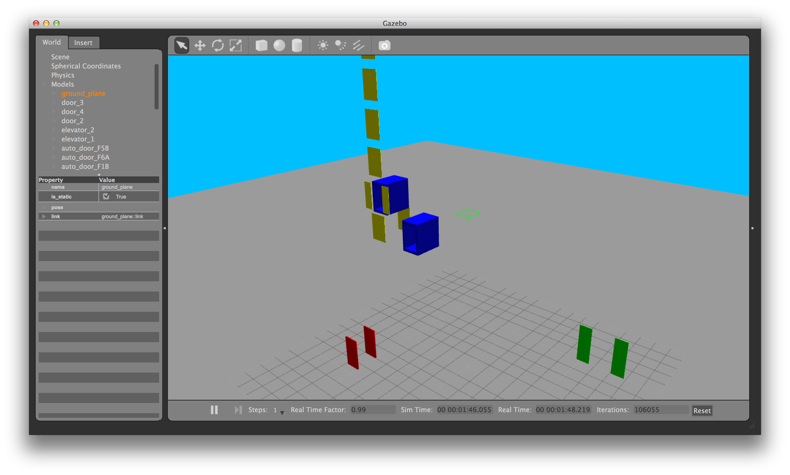

Dynamic Gazebo Models
==============

Gazebo models for simulating doors/elevators. Currently available models: flip-open doors, slide-open doors, elevators with automatic slide-open doors (more coming soon). Plus, the bundle also comes with a generic dynamics-manager to control model groups through ROS service-calls or keyboard-op.

## Architecture

The dynamic properties of a model, e.g.:linear & angular velocities, are controlled via topics. These topics are wrapped with a layer of custom services to process commands such as 'open-close' for flip-open doors  or 'target floor' for elevators.

## Dependencies & Prerequisites
[ROS Hydro](http://wiki.ros.org/hydro), [Gazebo 3.0+](http://gazebosim.org/), 
[Catkin](http://wiki.ros.org/catkin): see [package.xml](package.xml)

## Installation
Clone and catkin_make
```bash
$ git clone https://github.com/MohitShridhar/dynamic_gazebo_models.git
$ cd <catkin_ws>
$ catkin_make --pkg dynamic_gazebo_models
```
Launch sample:
```bash
$ roslaunch dynamic_gazebo_models dynamic_models_test.launch
```
There are a lot of models to spawn, so be patient. After a while, you should see a bunch of doors and elevators:


## Usage

### Manual control
```bash
$ rosrun dynamic_gazebo_models keyboard_op 
```
Follow the instructions to control a group of doors | elevators.
### Service Calls
Include `dynamics_manager` node in your launch file (where you spawn your doors and elevators):
```xml
<node pkg="dynamic_gazebo_models" type="dynamics_manager" name="dynamics_manager" output="screen"/>
```

List of available services:
```bash
$ rosservice list
...
/model_dynamics_manager/add_control_group
/model_dynamics_manager/delete_control_group
/model_dynamics_manager/doors/open_close
/model_dynamics_manager/doors/set_vel
/model_dynamics_manager/elevators/open_close_elev
/model_dynamics_manager/elevators/set_props
/model_dynamics_manager/elevators/target_floor
/model_dynamics_manager/list_groups
...
```
Before you can send commands such as 'open doors', you need to create a group (of a single type; elevators or doors) specifying the desired units you want to control. This can be done during launch or runtime.

Add Group (**command-line**):
```bash
$ rosservice call /model_dynamics_manager/add_control_group "group: 
  group_name: 'New_group_of_doors'
  type: 'door'
  active_units: [1, 3, 4]"
```
This will add a new control group with doors 1, 3 & 4. *Hint:* Type `rosservice call /model_dynamics_manager/add_control_group` and press TAB to auto-complete the service-request.

Add Group (**launch file**):
```xml
<node pkg="rosservice" type="rosservice" name="all_doors" args="call 
$(arg add_group_srv)
'{ 
group: 
  {
    group_name: 'New_group_of_doors',
    type: 'door',
    active_units: [1, 3, 4]
  }
}'
"/>
```
Add Group (**cpp**):
```cpp
#include <dynamic_gazebo_models/AddGroup.h>
...
	ros::ServiceClient add_group_client = rosNode.serviceClient<dynamic_gazebo_models::AddGroup>("model_dynamics_manager/add_control_group");

    dynamic_gazebo_models::AddGroup addSrv;
    addSrv.request.group.group_name = "New_group_of_doors";
    addSrv.request.group.type = "door";
    addSrv.request.group.active_units = {1, 3, 4};
    
    add_group_client.call(addSrv);
...
```
Once you have setup your groups, you can use other services such as `/model_dynamics_manager/doors/open_close` in a similar fashion to control the dynamics of the model:
```bash
rosservice call /model_dynamics_manager/doors/open_close "group_name: 'New_group_of_doors'
state: true"
```
To open doors 1, 3 & 4 simultaneously.


